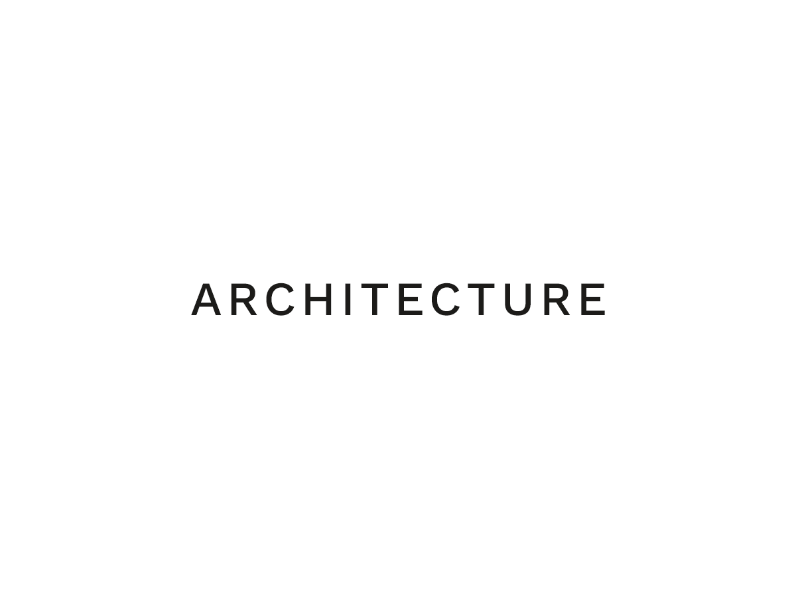

# Architecture

An opinionated SCSS architecture based on [Hugo Giraudel](https://github.com/HugoGiraudel)'s work.



## Dependencies

- [Bootstrap](https://github.com/twbs/bootstrap-sass), we only load the grid for convenience
- [Breakpoint](https://github.com/at-import/breakpoint)
- [Breakpoint slicer](https://github.com/lolmaus/breakpoint-slicer)
- [Ress](https://github.com/filipelinhares/ress), a modern CSS reset

## Tasks

### Watch

```
npm run sass:watch
```

### Prod

Autoprefixer and compressed

```
npm run prod
```

## References

- [Sass Guidelines](https://sass-guidelin.es/#architecture)
